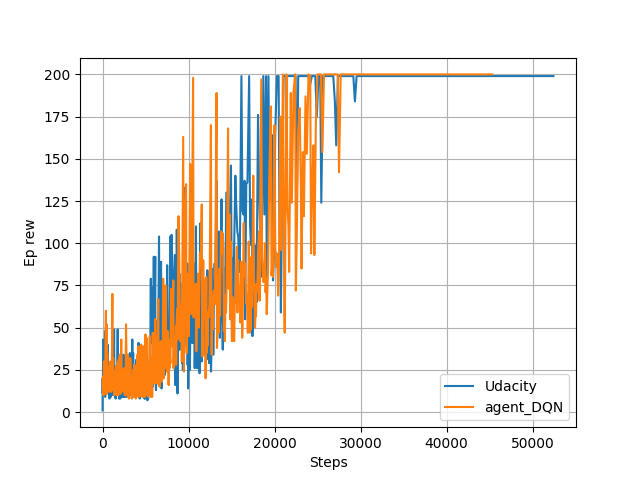

# DQN Algorithm (CartPole)

DQN algorithm working on CartPole.

## Getting Started

These instructions will get you a copy of the project up and running on your local machine for development and testing purposes. See deployment for notes on how to deploy the project on a live system.

### Dependencies

* TensorFlow
* OpenAI Gym

## Running the tests

Running 'agent_DQN.py' produces a result file called 'rew_new.dat'. The algorithm can be validated by comparing the results inside 'rew_orig.dat' produced by the original (mutilated) Udacity DQN agent.

## Authors

Written by Robin (21.5.2018)

## Acknowledgments

* [Simple Reinforcement Learning with Tensorflow Part 4: Deep Q-Networks and Beyond](https://medium.com/@awjuliani/simple-reinforcement-learning-with-tensorflow-part-4-deep-q-networks-and-beyond-8438a3e2b8df)
* [Udacity's deep learning github repository](https://github.com/udacity/deep-learning/tree/master/reinforcement)

